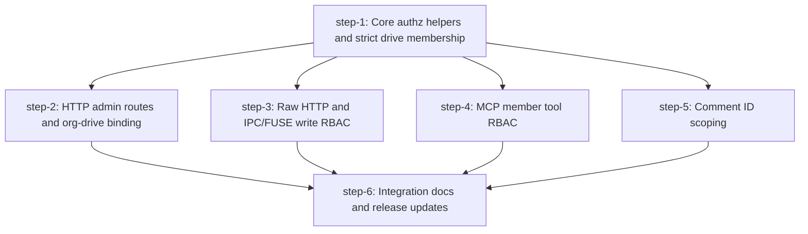

# Multi-Tenant RBAC Safety — Plan (DAG)

## Overview

Harden agent-fs for hosted multi-tenant use where mutually distrustful users share one server and one S3-compatible backing bucket.

- **Motivation**: agent-fs currently namespaces S3 objects by org/drive, but tenant isolation depends on application-layer RBAC and several HTTP/MCP/raw/comment paths bypass or weaken those checks.
- **Related**: `AGENTS.md`, `docs/deployment.md`, `docs/api-reference.md`, `docs/fuse-mount.md`, `packages/core/src/identity/rbac.ts`, `packages/server/src/routes/orgs.ts`, `packages/server/src/routes/files.ts`, `packages/mcp/src/server.ts`, `packages/core/src/ops/comment.ts`

## Current State Analysis

- S3 keys are already org/drive-prefixed by `getS3Key()` as `<orgId>/drives/<driveId>/<path>` in `packages/core/src/ops/versioning.ts:7-14`.
- File and version metadata are mostly drive-scoped through `(path, drive_id)` keys and indexes in `packages/core/src/db/schema.ts:74-127`.
- Normal JSON ops use centralized RBAC: op role requirements live in `packages/core/src/identity/rbac.ts:14-44`, and `dispatchOp()` checks permissions before handler execution in `packages/core/src/ops/index.ts:293-304`.
- HTTP `/orgs/:orgId/ops` and generated MCP op tools both call `dispatchOp()` in `packages/server/src/routes/ops.ts:22-39` and `packages/mcp/src/tools.ts:26-29`.
- Raw binary writes bypass centralized RBAC. `PUT /raw` calls `writeRaw()` directly in `packages/server/src/routes/files.ts:117-178`, while `writeRaw()` has no role check in `packages/core/src/ops/write.ts:37-49`.
- IPC/FUSE write paths also call `writeRaw()` directly for write/create/truncate flows in `packages/server/src/ipc/handlers.ts:313-363`.
- Explicit `driveId` context ignores the route `orgId`: `resolveContext()` returns the drive's stored org when `driveId` is present without checking `params.orgId` in `packages/core/src/identity/context.ts:17-31`.
- HTTP org/member/drive management routes authenticate the caller but do not authorize caller role before creating drives or mutating/listing members in `packages/server/src/routes/orgs.ts:49-123`.
- MCP member management tools call identity helpers directly without admin-role checks in `packages/mcp/src/server.ts:120-214`.
- `createDrive()` creates a drive without adding the creator as a drive member in `packages/core/src/identity/drives.ts:5-22`, while `listDrivesForUser()` treats drives with zero member rows as visible in `packages/core/src/identity/drives.ts:50-77`.
- Comment rows store `orgId` and `driveId` in `packages/core/src/db/schema.ts:129-154`, but comment ID handlers fetch by `id` without scoping to `ctx.orgId`/`ctx.driveId` in `packages/core/src/ops/comment.ts:240-441`.
- Signed URLs are an intentional escape hatch: the op is viewer-accessible in `packages/core/src/ops/index.ts:218-224`, creates unauthenticated S3 URLs in `packages/core/src/ops/signed-url.ts:23-44`, and should remain documented as bearer-token-like until expiry.
- Repository rules require release checklist coverage for core/CLI/MCP changes: skill update if behavior changes, plugin version if skill changes, package version bump, and E2E coverage in `AGENTS.md:31-44`.

Confirmed planning scope: hosted hardening for mutually distrustful API users, including release/docs/version work.

## Desired End State

- Every server-visible operation that reads, writes, lists, or manages tenant resources proves the authenticated user has an explicit role for the target org/drive.
- Explicit `driveId` inputs are bound to the route/current `orgId`; cross-org `driveId` substitution fails before any file/member/comment access.
- Drives require explicit `drive_members` rows. New drives grant the creator/admin explicit admin membership, and existing empty drives are backfilled or rejected deterministically.
- Raw HTTP and IPC/FUSE writes require editor-or-better, matching JSON `write`/`append`/`rm` semantics.
- HTTP and MCP member/drive administration require admin-level roles, and member lists do not leak across org/drive boundaries.
- Comment ID and parent-comment operations are scoped to the active org/drive.
- Signed URLs remain supported but are clearly documented as unauthenticated bearer URLs after RBAC-checked generation.
- Tests and E2E coverage prove the hosted multi-tenant isolation model across core, HTTP, MCP, raw/FUSE, and comment surfaces.

## What We're NOT Doing

- Not adding S3 bucket-per-tenant or per-tenant S3 credentials.
- Not encrypting tenant data with tenant-specific keys.
- Not changing the signed-url maximum expiry or adding a disable flag in this plan.
- Not redesigning the user/auth model beyond API-key-authenticated RBAC checks.
- Not adding a UI for org/drive/member management.

## Implementation Approach

- Add reusable authorization helpers in core identity so HTTP routes, MCP tools, IPC/FUSE handlers, and tests share the same role and org/drive binding rules.
- Switch drive visibility to strict explicit membership; creation/backfill ensures existing and new drives remain usable without preserving the current zero-member public-drive behavior.
- Harden independent vertical surfaces after the shared core helper step: HTTP admin routes, raw HTTP/IPC writes, MCP member tools, and comment ID scoping can run in parallel.
- Keep signed URLs behavior unchanged but update docs to make the escape hatch explicit: RBAC is checked at URL generation time, not at later S3 access time.
- Add a final integration/release step for cross-surface E2E, docs, skill/plugin/version checklist, and whole-repo verification.

## Quick Verification Reference

Common commands any step or wave will use:

- `bun run typecheck`
- `bun run test`
- `bun run build`
- `bun run scripts/e2e.ts "bun run packages/cli/src/index.ts --"`
- `cargo test -p agent-fs-fuse`

## DAG

## Steps

| ID | Name | Depends on | Status | File |
|----|------|------------|--------|------|
| step-1 | Core authz helpers and strict drive membership | — | ready | [step-1.md](./step-1.md) |
| step-2 | HTTP admin routes and org-drive binding | step-1 | ready | [step-2.md](./step-2.md) |
| step-3 | Raw HTTP and IPC/FUSE write RBAC | step-1 | ready | [step-3.md](./step-3.md) |
| step-4 | MCP member tool RBAC | step-1 | ready | [step-4.md](./step-4.md) |
| step-5 | Comment ID scoping | step-1 | ready | [step-5.md](./step-5.md) |
| step-6 | Integration docs and release updates | step-2, step-3, step-4, step-5 | ready | [step-6.md](./step-6.md) |

> **Canonical dependencies and execution status live in each `step-<n>.md`'s frontmatter.** This table is a derived snapshot at plan creation. During `/v-implement`, frontmatter `status` (`ready` → `claimed` → `done`) is the source of truth — re-render this table when you want a current view.

## Pre-flight Verification

Run before kicking off any step (orchestrator's responsibility — `/v-implement` performs these once at the start of the run):

- [ ] Working tree is clean or only contains intentional in-flight work.
- [ ] Baseline typecheck passes: `bun run typecheck`.
- [ ] Baseline tests pass: `bun run test`.
- [ ] Docker is available if running the full E2E suite with MinIO/FUSE scenarios.
- [ ] Rust/Cargo toolchain is available if running FUSE helper tests.

## Global Verification

Run after all steps complete (final wave gate):

- [ ] Whole-repo typecheck: `bun run typecheck`.
- [ ] Full test suite: `bun run test`.
- [ ] CLI bundle builds: `bun run build`.
- [ ] Full E2E suite passes against isolated MinIO: `bun run scripts/e2e.ts "bun run packages/cli/src/index.ts --"`.
- [ ] FUSE helper tests pass where Rust is available: `cargo test -p agent-fs-fuse`.
- [ ] Landing docs still build if docs changed: `pnpm --dir landing build`.
- [ ] Version sync dry-run reports the intended patch bump before writing: `bun run scripts/sync-versions.ts 0.7.6 --dry-run`.
- [ ] OpenAPI generation is up to date if output changes: `bun run scripts/sync-openapi.ts`.

## Appendix

- **Commit preference**: commit after each step once Taras confirms manual verification passed.
- **Commit format**: `[step-N] <brief description>`.
- **Release checklist**: because this plan changes core/server/MCP behavior, implementation must consider `skills/agent-fs/SKILL.md`, bump `.claude-plugin/plugin.json` if the skill changes, bump package versions, and add/run E2E coverage as required by `AGENTS.md`.
- **Follow-up plans**: consider storage-layer tenant isolation later if agent-fs needs hard isolation against server credential leaks.
- **Derail notes**: signed URLs remain an intentional escape hatch in this plan and must be treated as bearer secrets until expiry.
