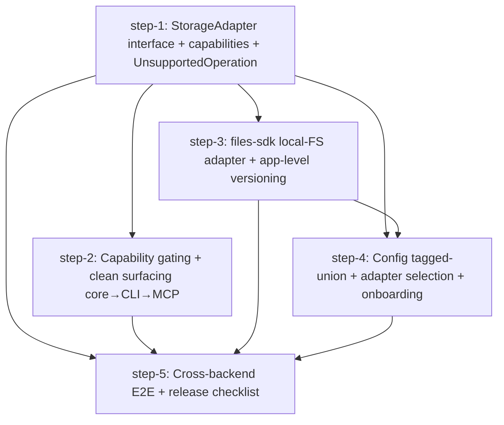

# Multi-Adapter Storage via a thin `StorageAdapter` interface — Plan (DAG)

## Overview

Introduce a thin internal `StorageAdapter` interface so agent-fs storage supports multiple backends. Keep the existing `AgentS3Client` as the full-featured S3/MinIO adapter (behavior unchanged), and add a `files-sdk`-backed **local-filesystem** adapter for breadth. Backends are feature-tiered: S3/MinIO and local-FS get full versioning (`revert`/historical `diff`); other (future) adapters degrade gracefully. The durable value — file **comments** and **search** — is SQLite-side and keeps working on every backend.

- **Motivation**: Get automatic support for a broad set of storage backends (S3/MinIO today, local-FS next, consumer providers like Dropbox/GDrive later) behind one internal interface, without re-litigating the proven S3 path.
- **Related**: `thoughts/taras/research/2026-06-25-files-sdk-storage-adapters.md` (research + locked Decisions), `packages/core/src/s3/client.ts`, `packages/core/src/ops/types.ts`, `packages/server/src/index.ts:13`.

## Current State Analysis

All object I/O flows through one concrete class, **`AgentS3Client`** (`packages/core/src/s3/client.ts:51`) — the only importer of `@aws-sdk/*`. Consumers see it solely as `ctx.s3: AgentS3Client` on `OpContext` (`packages/core/src/ops/types.ts:5-13`). ~16 ops call `ctx.s3.<method>()`; none import the AWS SDK. A duck-typed `MockS3Client` mirrors the surface for tests, wired in via an `as any` cast (`packages/core/src/test-utils.ts:225`) — there is **no shared interface yet**.

The 10-method surface any adapter must satisfy (`client.ts`): `putObject` `:78-97`, `getObject(key, versionId?)` `:99-120`, `deleteObject` `:122-129`, `copyObject` `:131-143`, `listObjects(prefix,{delimiter})` `:145-165`, `headObject` `:167-181`, `listObjectVersions` `:183-198`, `checkVersioningEnabled` `:200-209`, `enableVersioning` `:211-224`, `getPresignedUrl(key,expiresIn,responseContentType?)` `:226-238`, plus the `versioningEnabled: boolean` field.

Key facts that shape the design:
- **Almost all "filesystem" semantics live in SQLite**, not S3: version numbering (`getNextVersion`, `versioning.ts:19-35`), history (`log.ts:11-22`), dedup, optimistic concurrency (`assertExpectedVersion`, `versioning.ts:92-109`), FTS5 search, comments. The object store is a dumb keyed blob store: `getS3Key` → `<orgId>/drives/<driveId>/<path>` (`versioning.ts:11-14`).
- **The one S3 leak is object versioning** for old-content retrieval: `revert` hard-requires `s3_version_id` (`revert.ts:44-54`); historical `diff` reads two version-ids in parallel and degrades to a stored `diffSummary` when absent (`diff.ts:49-91`).
- **Single construction site**: `new AgentS3Client(config.s3)` at `packages/server/src/index.ts:13`, threaded into routes/IPC/MCP by `createApp` (`app.ts:18-77`).
- **Non-atomic write path**: `write.ts` does `putObject` then `createVersion` (a SQLite transaction) as two steps — object-first ordering, but no orphan cleanup today.
- S3 error-shape coupling: ops branch on `err.name === "NoSuchKey"|"NotFound"` / `httpStatusCode === 404` → `NotFoundError` (`cat.ts:45`, `stat.ts:18`, `append.ts:30`, `edit.ts:31`, `signed-url.ts:31`, `routes/files.ts:77`). Adapters must translate.

See the research doc for the full architecture map, the storage contract (§2), the files-sdk capability report (§6), and the locked **Decisions** (§ Decisions).

## Desired End State

- `StorageAdapter` interface + `StorageCapabilities` metadata type own the storage contract; `AgentS3Client implements StorageAdapter` (behavior untouched) and `MockS3Client` implements it too (the `as any` cast at `test-utils.ts:225` is gone). `OpContext.s3` is typed to the interface.
- A typed `UnsupportedOperation` error is thrown by ops a backend can't satisfy and is surfaced cleanly in CLI + MCP. Each adapter advertises `capabilities` (`{ versioning, presignedUrls }`).
- A `files-sdk`-backed **local-filesystem** adapter exists with **app-level per-version keys**, so `revert` and historical `diff` work on local without object versioning. `ls` directory listing works.
- `AgentFSConfig.s3` is a tagged union keyed by `provider`; the adapter is selected at `packages/server/src/index.ts:13`; onboarding supports a local-FS backend.
- E2E (`scripts/e2e.ts`) covers S3 **and** local (incl. revert/diff under each, plus an unsupported-op assertion). Release checklist done.

## What We're NOT Doing

- **No change to S3/MinIO behavior.** `AgentS3Client` only gains an `implements StorageAdapter` declaration; the S3 path stays green throughout.
- **No consumer-provider adapter (Dropbox/GDrive) or OAuth in this plan** — deferred to a follow-up plan (new config + per-drive credential storage + token refresh is a separate feature). _Confirmed with Taras 2026-06-25._
- **No multipart/streaming rewrite** of the buffered write path (independent improvement).
- **No per-org/per-drive backend selection** — storage stays a process-wide singleton (no new DB columns).

## Implementation Approach

- **Foundation first (step-1):** extract the interface everything else depends on, **including** the `StorageCapabilities` type and the typed `UnsupportedOperation` error. Putting the error in the contract (not in the gating step) lets adapters throw it without depending on step-2. Mechanical, low-risk.
- **Gating in parallel (step-2):** capability checks + clean surfacing of `UnsupportedOperation` through core ops → CLI → MCP, so limited backends fail cleanly instead of throwing raw S3/FS errors. Depends only on step-1.
- **Local adapter in parallel (step-3):** the first non-S3 adapter, with app-level versioning so local gets the full tier (revert/diff). Depends only on step-1 (throws the step-1 `UnsupportedOperation` for `signed-url`; QA'd via direct adapter integration tests). This is where the versioning-key scheme and the cross-store atomicity decision land.
- **Config + selection fourth (step-4):** tagged-union config + startup selection + onboarding, making the local backend reachable end-to-end by users. Needs the adapter (step-3).
- **Integration/E2E last (step-5):** cross-backend E2E + release checklist — the terminal node that proves S3 and local both pass, including an unsupported-op assertion.
- **Why this shape:** step-1 is the single foundation; **steps 2 and 3 are independent and run in parallel** after it; step-4 needs the adapter to select; step-5 gates on all. Consumer-provider/OAuth is pushed to a follow-up plan so it never blocks the core.

## Quick Verification Reference

- Typecheck: `bun run typecheck`
- Tests: `bun test` (manual/integration tests auto-skip without env)
- CLI help: `bun run packages/cli/src/index.ts -- <cmd> --help`
- E2E (Docker/MinIO): `bun run scripts/e2e.ts "bun run packages/cli/src/index.ts --"`

## DAG

## Steps

| ID | Name | Depends on | Status | File |
|----|------|------------|--------|------|
| step-1 | StorageAdapter interface + capabilities + UnsupportedOperation | — | ready | [step-1.md](./step-1.md) |
| step-2 | Capability gating + clean surfacing (core→CLI→MCP) | step-1 | ready | [step-2.md](./step-2.md) |
| step-3 | files-sdk local-FS adapter + app-level versioning | step-1 | ready | [step-3.md](./step-3.md) |
| step-4 | Config tagged-union + adapter selection + onboarding | step-1, step-3 | ready | [step-4.md](./step-4.md) |
| step-5 | Cross-backend E2E + release checklist | step-1, step-2, step-3, step-4 | ready | [step-5.md](./step-5.md) |

> **Canonical dependencies and execution status live in each `step-<n>.md`'s frontmatter.** This table is a derived snapshot at plan creation.

## Pre-flight Verification

- [x] Working tree is clean (or only intentional in-flight work)
- [x] Baseline tests pass: `bun test` (832 pass / 114 skip / 0 fail at baseline)
- [x] Baseline typecheck passes: `bun run typecheck`
- [x] Docker available for MinIO E2E (`scripts/e2e.ts`) — confirmed by step-5's real MinIO run

## Global Verification

- [x] Whole-repo typecheck: `bun run typecheck`
- [x] Full test suite: `bun test` (898 pass / 114 skip / 0 fail)
- [x] E2E suite passes against MinIO **and** a local-FS drive: `bun run scripts/e2e.ts "bun run packages/cli/src/index.ts --"` (127/127, 10 FUSE skipped on Darwin)
- [x] S3 path behavior unchanged (existing E2E + revert/diff still pass on MinIO)
- [x] Release checklist done: `skills/agent-fs/SKILL.md` updated, `.claude-plugin/plugin.json` + root `package.json` bumped (0.10.0)

## Confirmed Decisions (Taras, 2026-06-25)

1. **DAG shape** — 5 steps as above; consumer providers (Dropbox/GDrive) + OAuth deferred to a follow-up plan.
2. **Local-FS versioning** — **content-addressed blobs**: each version's bytes also stored at a reserved top-level `_afs-blobs/sha256/<hash>` key (outside any drive listing prefix); current version stays at the plain path key. `file_versions.s3_version_id` (now an opaque per-adapter version handle) holds the hash. revert/diff read by hash; dedup is free (reuses the existing `content_hash`, `write.ts:75-77`).
3. **`signed-url` on local** — capability metadata reports `presignedUrls:false` and the op **falls back to the daemon `/raw` URL** via `buildAppUrl` (`packages/core/src/ops/urls.ts`) rather than hard-failing. (step-3 must verify the `/raw` route's auth model.)
4. **Commits** — commit after each step once its manual verification passes (`[step-N] <desc>`).

## files-sdk Verification (live source check, 2026-06-25)

Verified against `github.com/haydenbleasel/files-sdk@main` (v2.0.0):
- **fs adapter** = `import { fs } from "files-sdk/fs"`; `import { Files } from "files-sdk"`. Constructor `fs({ root /* required */, urlBaseUrl? })`. Keys map to **nested paths** mirroring the key (`path.join(root, ...key.split("/"))`); `mkdir(recursive)` on write; traversal outside `root` throws.
- **Delimiter listing CONFIRMED** — `list({ prefix, delimiter: "/" })` → `{ items: StoredFile[], prefixes?: string[] }`; `items` = immediate files, `prefixes` = immediate subdirs (full keys w/ trailing `/`). fs sets `supportsDelimiter: true`. Maps cleanly onto the current `listObjects` → `{ objects, prefixes }` contract — **no `.raw` / client-side derivation needed**.
- **fs `url()` never presigns** — returns a `file://` URL (or `${urlBaseUrl}/${key}`); `signedUrl.supported = false`; `signedUploadUrl()` rejects. Confirms the `/raw` fallback for `signed-url`. `responseContentDisposition` is supported on S3's `url()` but **`responseContentType` is not** (needs `.raw` + `GetObjectCommand`) — moot here since S3 stays on `AgentS3Client` and local doesn't presign.
- **copy/move/head/download(range) CONFIRMED** on fs (`supportsRange: true`).
- **Error model** — `FilesError { code: "NotFound"|"Unauthorized"|"Conflict"|"ReadOnly"|"Provider" }`. Adapter translates `code === "NotFound"` into the S3-compatible not-found shape ops already branch on (`err.name ∈ {NoSuchKey, NotFound}` / `httpStatusCode 404`).
- **`head` returns `StoredFile`** `{ name, key, size, type, lastModified?, etag?, metadata?, arrayBuffer(), stream(), … }`; `download` returns the same lazy `StoredFile`. `exists(key) → boolean`.
- **Bun CONFIRMED** — package uses `bun test`, `packageManager: bun@1.3.14`, ships a `bun-s3` adapter; no Bun caveat for `fs`/`s3`.

## Appendix

- **Follow-up plans**: Consumer-provider adapter (Dropbox/GDrive) at the basic tier + OAuth token storage/refresh (deferred from this plan).
- **Derail notes**: Cross-store atomicity — the write path is `putObject` then `createVersion` (object-then-commit). For S3 and local the partial-failure window is unchanged/narrow (content-addressed blobs are dedup-shared and harmless to leave); real reconciliation/retry belongs with the remote/consumer adapter. Multipart/streaming for large uploads is an independent improvement.
- **References**:
  - Research: `thoughts/taras/research/2026-06-25-files-sdk-storage-adapters.md`
  - files-sdk: `https://files-sdk.dev/`, `https://github.com/haydenbleasel/files-sdk`, npm `files-sdk` v2.0.0
